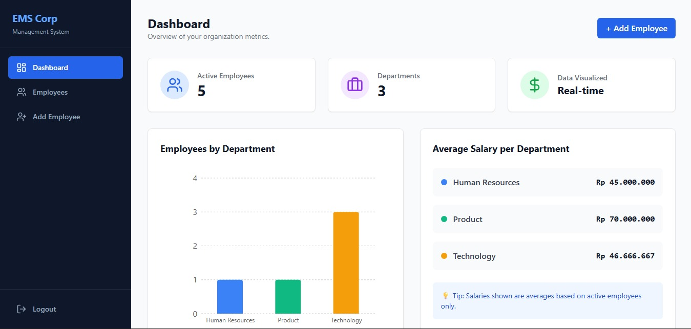
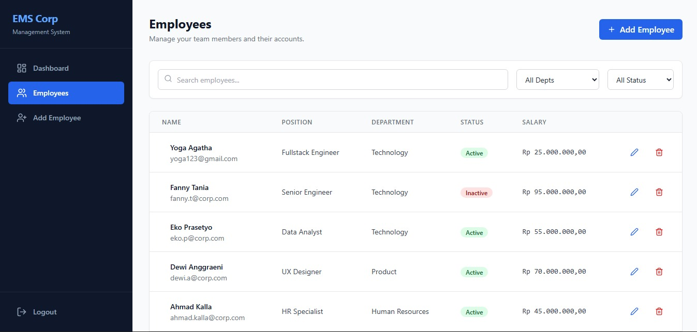
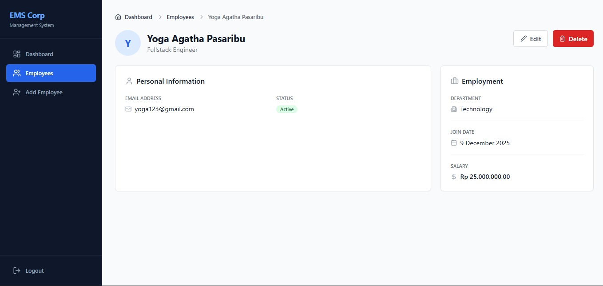
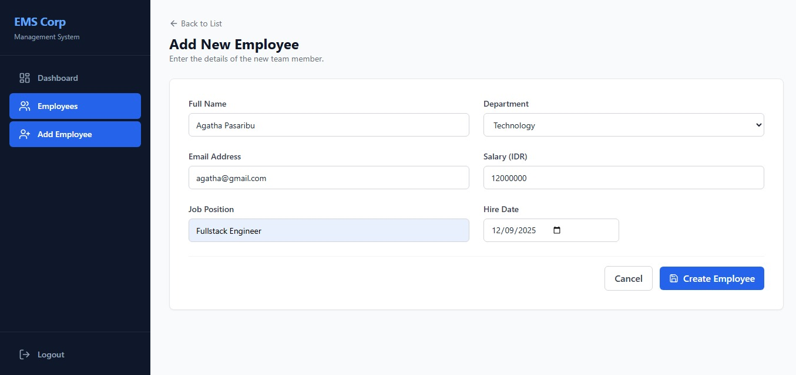
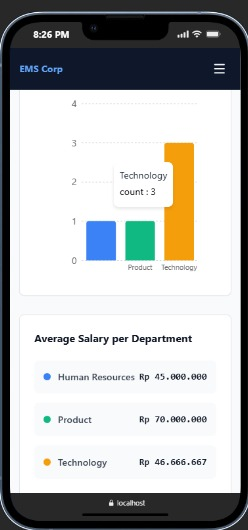
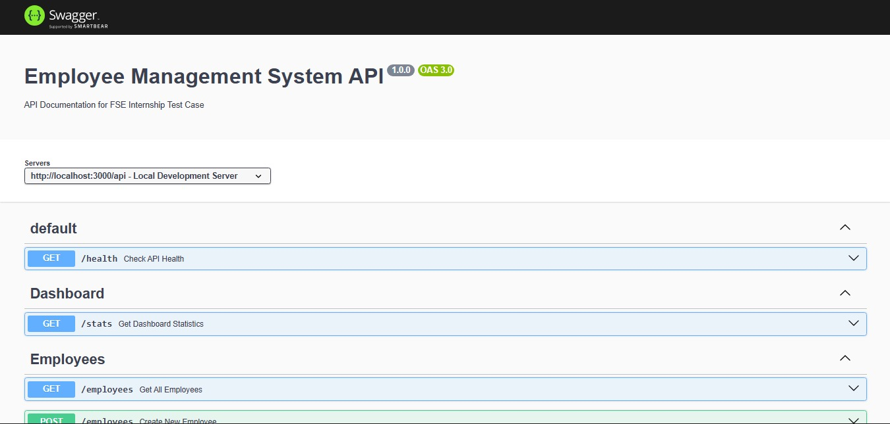

# Employee Management System (EMS)


## 📖 Project Overview

**Employee Management System (EMS)** adalah aplikasi web *Fullstack* yang dirancang untuk mengelola data karyawan perusahaan secara efisien. Proyek ini dikembangkan sebagai bagian dari **FSE Internship Test Case** untuk mendemonstrasikan kemampuan dalam membangun RESTful API, merancang antarmuka pengguna yang responsif, manajemen database, dan *containerization* aplikasi.

Aplikasi ini dibangun menggunakan arsitektur modern yang memisahkan **Frontend (React + Vite)** dan **Backend (Express.js)**, serta dibungkus sepenuhnya menggunakan **Docker Compose** untuk kemudahan deployment dan konsistensi environment.

## ✨ Fitur Utama (Key Features)

### 📊 Dashboard & Statistik
* **Visualisasi Data:** Grafik batang interaktif menampilkan distribusi karyawan per departemen.
* **Ringkasan Metrik:** Menampilkan total karyawan aktif, jumlah departemen, dan rata-rata gaji per departemen secara real-time.

### 👥 Manajemen Karyawan (CRUD)
* **Create:** Formulir tambah karyawan dengan validasi input yang ketat (format email, gaji positif, dll).
* **Read:**
    * Tabel data responsif dengan pagination.
    * **Pencarian Cerdas (Search):** Cari berdasarkan Nama, Email, atau Jabatan.
    * **Filter Canggih:** Filter data berdasarkan Departemen dan Status (Active/Inactive).
* **Update:** Edit informasi karyawan dengan mudah menggunakan formulir yang terisi otomatis.
* **Delete (Soft Delete):** Mengimplementasikan mekanisme *Soft Delete* dimana data tidak dihapus permanen dari database, melainkan statusnya diubah menjadi `inactive` demi keamanan data.

### 🛡️ Keamanan & Validasi
* **Validasi Input:** Menggunakan **Zod** di kedua sisi (Frontend & Backend) untuk menjamin integritas data.
* **Rate Limiting:** Perlindungan API dari request berlebih (spam/DDoS ringan).
* **Security Headers:** Menggunakan Helmet.js untuk keamanan HTTP header standar.

### 💻 Developer Experience
* **Dockerized:** Setup satu perintah (`docker-compose up`) untuk menjalankan Database, Backend, dan Frontend sekaligus.
* **API Documentation:** Dokumentasi endpoint interaktif menggunakan **Swagger UI**.
* **Logging:** Pemantauan request HTTP menggunakan Morgan logger.

## 🚀 Tumpukan Teknologi (Tech Stack)

Aplikasi ini dibangun menggunakan teknologi terkini yang standar di industri untuk menjamin performa, skalabilitas, dan kemudahan pemeliharaan.

### **Frontend (Client-Side)**
* **[React.js](https://react.dev/) (via Vite)**: Library UI utama untuk membangun antarmuka yang interaktif dan cepat.
* **[Tailwind CSS](https://tailwindcss.com/)**: Framework CSS *utility-first* untuk styling yang modern dan responsif.
* **[TanStack Query (React Query v5)](https://tanstack.com/query/latest)**: Manajemen *server state* (caching, fetching, synchronizing) standar industri.
* **[React Hook Form](https://react-hook-form.com/)**: Manajemen state formulir yang performan.
* **[Zod](https://zod.dev/)**: Skema validasi data yang sinkron dengan backend.
* **[Recharts](https://recharts.org/)**: Library visualisasi data untuk grafik Dashboard.
* **[Lucide React](https://lucide.dev/)**: Set ikon yang ringan dan konsisten.

### **Backend (Server-Side)**
* **[Node.js](https://nodejs.org/) & [Express.js](https://expressjs.com/)**: Runtime dan framework backend yang cepat dan minimalis.
* **[PostgreSQL](https://www.postgresql.org/)**: Sistem manajemen database relasional yang handal (dijalankan via Docker).
* **[Prisma ORM](https://www.prisma.io/)**: ORM modern untuk interaksi database yang *type-safe* dan efisien.
* **[Swagger UI](https://swagger.io/)**: Dokumentasi API interaktif yang digenerate dari file OpenAPI JSON.
* **[Morgan](https://www.npmjs.com/package/morgan)**: HTTP request logger untuk monitoring traffic.
* **[Helmet](https://helmetjs.github.io/)**: Middleware keamanan untuk mengamankan HTTP headers.

### **DevOps & Tools**
* **[Docker](https://www.docker.com/) & Docker Compose**: Untuk kontainerisasi aplikasi (Frontend, Backend, Database) agar berjalan konsisten di berbagai lingkungan OS.
* **Git**: Version control system.

## 🛠️ Prasyarat (Prerequisites)

Sebelum menjalankan proyek, pastikan perangkat lunak berikut telah terinstal di komputer Anda:

* **[Docker Desktop](https://www.docker.com/products/docker-desktop/)** (Wajib, pastikan Docker Engine berjalan).
* **[Git](https://git-scm.com/)**.

*Catatan: Anda **TIDAK PERLU** menginstal Node.js atau PostgreSQL secara lokal di mesin Anda. Semua lingkungan runtime sudah disediakan secara otomatis di dalam Container Docker.*

## ⚙️ Instalasi & Setup (Installation)

Ikuti langkah-langkah berikut untuk menjalankan aplikasi sepenuhnya menggunakan Docker:

### 1. Clone Repository
Salin kode sumber proyek ke komputer lokal Anda.

```bash
git clone https://github.com/gathacom/Employee-Management-System-FSE-Intern.git
cd employee-management-system-fse-intern

```

### 2. Konfigurasi Environment Variables
Backend membutuhkan konfigurasi environment agar bisa terhubung ke database. Saya telah menyediakan file `.env.example` yang sudah dikonfigurasi khusus untuk lingkungan Docker.

Salin file tersebut menjadi `.env`:

```bash
# Masuk ke folder backend
cd backend

# Salin file example ke file .env (Windows Command Prompt: copy .env.example .env)
cp .env.example .env

# Kembali ke root project
cd ..
```

*Catatan: Anda tidak perlu mengubah isi file `.env` jika menjalankannya menggunakan Docker, karena kredensial default sudah disesuaikan dengan konfigurasi `docker-compose.yml`.*

### 3. Jalankan Aplikasi dengan Docker Compose
Jalankan perintah berikut di terminal (Root Project) untuk membangun dan menjalankan semua layanan (Database, Backend, Frontend) sekaligus.

```bash
docker-compose up --build -d
```

* `--build`: Memaksa Docker untuk membangun ulang image agar perubahan kode terbaru terikut.
* `-d`: Menjalankan container di background (detached mode).

*Harap tunggu beberapa saat (1-2 menit) pada proses pertama kali agar Docker mengunduh image dan PostgreSQL melakukan inisialisasi database.*

### 4. Akses Aplikasi
Setelah container berjalan, Anda dapat mengakses layanan berikut di browser Anda:

| Layanan | URL Akses | Deskripsi |
| :--- | :--- | :--- |
| **Frontend UI** | [http://localhost:5173](http://localhost:5173) | Antarmuka Aplikasi Utama (Dashboard) |
| **Backend API** | [http://localhost:3000/api](http://localhost:3000/api) | Base URL API |
| **API Docs** | [http://localhost:3000/api-docs](http://localhost:3000/api-docs) | Dokumentasi Swagger Interaktif |
| **Health Check**| [http://localhost:3000/api/health](http://localhost:3000/api/health) | Cek Status Server Backend |

### 🛑 Menghentikan Aplikasi
Jika Anda ingin menghentikan aplikasi dan menghapus container:

```bash
docker-compose down
```

## 📚 Dokumentasi API (API Documentation)

Dokumentasi lengkap dan interaktif tersedia di **Swagger UI**. Setelah server berjalan, kunjungi:
👉 **[http://localhost:3000/api-docs](http://localhost:3000/api-docs)**

Berikut adalah ringkasan endpoint utama yang tersedia:

| Method | Endpoint | Deskripsi |
| :--- | :--- | :--- |
| `GET` | `/api/employees` | Mengambil daftar karyawan. Mendukung pagination (`page`, `limit`), pencarian (`search`), dan filtering (`department`, `status`). |
| `POST` | `/api/employees` | Menambah data karyawan baru. Validasi input diterapkan. |
| `GET` | `/api/employees/:id` | Mengambil detail karyawan berdasarkan ID. |
| `PUT` | `/api/employees/:id` | Memperbarui data karyawan. |
| `DELETE`| `/api/employees/:id` | Melakukan **Soft Delete** (mengubah status menjadi `inactive`). |
| `GET` | `/api/employees/stats`| Mengambil data statistik dashboard (Total karyawan, breakdown departemen, rata-rata gaji). |

**Contoh Request (cURL):**
```bash
# Get Employees with Filter
curl -X GET "http://localhost:3000/api/employees?page=1&limit=5&department=Technology" \
     -H "Content-Type: application/json"
```

## 📂 Struktur Proyek (Project Structure)

Proyek ini diorganisir menggunakan struktur **Monorepo** (Backend & Frontend dalam satu repositori) dengan konfigurasi Docker di root.

```text
project-root/
├── backend/                # Backend Application (Express.js)
│   ├── src/
│   │   ├── config/         # Konfigurasi Prisma & Database
│   │   ├── controllers/    # Logika Bisnis (CRUD, Stats)
│   │   ├── middlewares/    # Error Handling, Validation, Rate Limiter
│   │   ├── routes/         # Definisi API Routes
│   │   ├── docs/           # Swagger JSON Documentation
│   │   ├── validations/    # Skema Validasi Zod
│   │   └── app.js          # Entry Point Aplikasi
│   ├── prisma/             # Schema Database & Migrations
│   ├── Dockerfile          # Konfigurasi Image Backend
│   └── .env.example        # Template Environment Variables
├── frontend/               # Frontend Application (React + Vite)
│   ├── src/
│   │   ├── components/     # Atomic Design (atoms, molecules, organisms)
│   │   ├── pages/          # Halaman (Dashboard, List, Form, Detail)
│   │   ├── services/       # Axios API Calls (Terpusat)
│   │   ├── hooks/          # Custom Hooks (useDebounce, etc)
│   │   └── utils/          # Helper Functions
│   ├── Dockerfile          # Konfigurasi Image Frontend
│   └── tailwind.config.js  # Konfigurasi Styling
├── database/
│   └── init.sql            # Script SQL untuk inisialisasi tabel & data awal
└── docker-compose.yml      # Orkestrasi Container (App, DB, Frontend)
```

## 📸 Screenshots

Berikut adalah tampilan antarmuka aplikasi yang telah dibangun:

*(Catatan: Gambar disimpan di folder `screenshots` pada root project)*

| **Dashboard View** | **Employee List** |
| :---: | :---: |
|  |  |
| *Visualisasi Data Statistik* | *Tabel Data dengan Search & Filter* |

| **Employee Detail** | **Add/Edit Form** |
| :---: | :---: |
|  |  |
| *Detail Profil & Aksi* | *Formulir Validasi* |

| **Dashboard Mobile View** | **Side Navbar** |
| :---: | :---: |
|  |  |
| *Visual Dashboard Mobile* | *Side Navbar Pada Mobile* |

| **Dokumentasi API** |
| :---: |
|  |
| *Dokumentasi API dengan Swagger* |
## 💡 Tantangan & Solusi (Challenges & Solutions)

Selama proses pengembangan, terdapat beberapa tantangan teknis yang dihadapi dan berhasil diselesaikan:

### 1. Kompatibilitas Prisma dengan Docker Alpine
* **Tantangan:** Prisma Client yang digenerate di host (Windows) gagal berjalan di container `node:alpine` karena perbedaan library SSL (`openssl` vs `musl`).
* **Solusi:** Mengganti Base Image Docker menjadi `node:20` (Debian) yang lebih stabil untuk Prisma dan menambahkan konfigurasi `binaryTargets = ["native", "debian-openssl-3.0.x"]` pada `schema.prisma`.

### 2. Hot Reload di Docker (Windows)
* **Tantangan:** Perubahan kode di Frontend (Vite) dan Backend (Nodemon) seringkali tidak terdeteksi secara otomatis saat berjalan di Docker Desktop for Windows karena limitasi *file system events*.
* **Solusi:** Mengaktifkan mode *polling* pada Nodemon (flag `-L`) dan konfigurasi `usePolling: true` pada Vite, sehingga perubahan file selalu terdeteksi meski sedikit memakan resource lebih.

### 3. Konsistensi Validasi Data
* **Tantangan:** Memastikan aturan validasi (seperti format email atau gaji positif) konsisten antara Form di Frontend dan Database.
* **Solusi:** Menggunakan library **Zod** di kedua sisi. Skema validasi dibuat identik agar error yang ditangkap di UI sesuai dengan aturan yang diterapkan di Backend.

## 🚀 Pengembangan Masa Depan (Future Improvements)

Jika diberikan waktu pengembangan lebih lanjut, fitur-fitur berikut akan ditambahkan untuk menyempurnakan aplikasi:

1.  **Otentikasi & Otorisasi:** Implementasi Login (JWT) untuk membedakan hak akses antara Admin dan User biasa.
2.  **Export Data:** Fitur untuk mengunduh laporan karyawan ke format CSV atau Excel.
3.  **Upload Foto Profil:** Integrasi dengan cloud storage (seperti AWS S3 atau Supabase Storage) untuk menyimpan foto karyawan.
4.  **Unit & Integration Testing:** Menambahkan pengujian otomatis menggunakan Jest (Backend) dan Vitest (Frontend) untuk menjamin stabilitas kode.

---
**Dibuat oleh Yoga Agatha Pasaribu - 2025**
